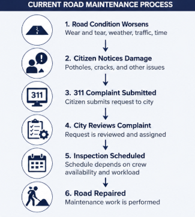
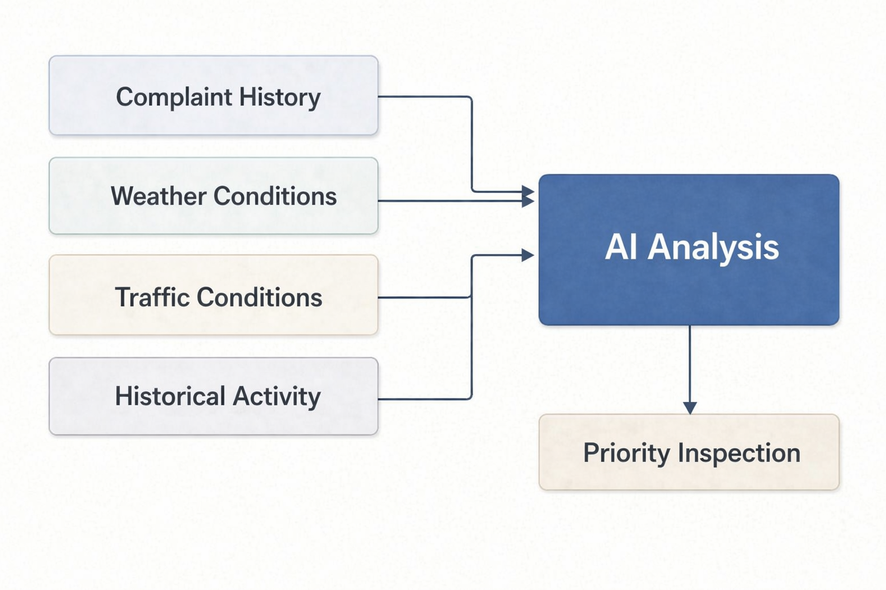
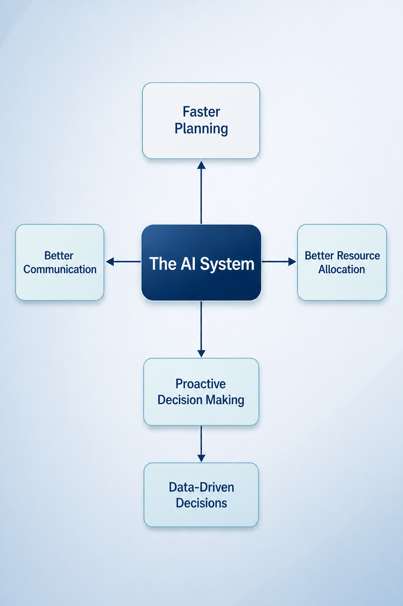

# AI-Powered Road Maintenance Planning

Transforming historical infrastructure data into proactive inspection planning.

## The Challenge

Transportation agencies receive thousands of road-related complaints every year through public reporting systems such as 311. Every request must be reviewed, prioritized, and assigned for inspection while balancing limited maintenance crews, changing weather conditions, and traffic demands.

Because resources are limited, deciding which roads deserve immediate attention is a difficult planning challenge. Most maintenance processes are reactive, meaning inspections typically begin only after road conditions have already deteriorated and a complaint has been submitted.

The proposed solution addresses this challenge by analyzing historical complaint patterns, weather conditions, traffic information, and other operational factors to recommend which roads should be inspected first.

---

# Our Solution

The proposed solution was developed to answer one simple but important question:

> **If inspection crews could only inspect a small number of roads today, which ones should receive attention first?**

Instead of requiring transportation planners to manually review thousands of historical complaints, the application analyzes multiple sources of roadway information and organizes them into a prioritized inspection plan.

Rather than replacing engineers or field inspectors, the solution supports existing maintenance operations by transforming complex historical data into clear, explainable recommendations that help teams make faster and more informed decisions.

---

# From Data to Decisions

Transportation agencies collect enormous amounts of infrastructure data every day. However, having more information does not automatically make planning easier.

The proposed solution combines historical complaint records, weather information, traffic conditions, and roadway characteristics to transform raw infrastructure data into practical operational guidance.

Instead of reviewing thousands of individual records, transportation planners receive:

- A ranked inspection priority list
- Roads requiring immediate attention
- Estimated maintenance workload
- Suggested staffing requirements
- Clear explanations supporting every recommendation

The result is a planning process that is faster, more organized, and easier to communicate across maintenance teams.

.png)

---

# Looking Beyond Individual Complaints

A single complaint rarely provides enough information to understand the overall condition of a roadway.

Instead of relying on complaint history alone, the proposed solution evaluates multiple factors simultaneously, including environmental conditions, roadway usage, and historical activity.

By considering these factors together, planners gain a broader understanding of which roads may require attention and can compare roadway conditions using one consistent decision-making approach rather than evaluating each complaint individually.

---

# Planning for Changing Conditions

Road conditions can change rapidly as weather patterns, traffic volumes, and seasonal conditions evolve throughout the year.

Rather than waiting for new complaints to appear, transportation planners can evaluate different operating scenarios before inspection crews are deployed. This allows agencies to anticipate how changing conditions may influence inspection priorities and maintenance workload.

By comparing multiple planning scenarios, decision-makers can prepare for potential changes instead of reacting after roadway conditions have already worsened.

This approach shifts maintenance planning from a reactive process toward a more proactive and data-informed strategy.

---

# Every Road Is Considered

One of the greatest strengths of the proposed solution is its ability to evaluate every available roadway profile within the selected borough before generating recommendations.

Rather than analyzing only a small sample of roads, the application reviews every available roadway profile, assigns an inspection priority, and highlights only those requiring the greatest attention.

Although only the highest-priority roads are displayed to the user, every available roadway is evaluated behind the scenes. This gives transportation planners confidence that recommendations are based on a complete assessment rather than isolated observations.

---

# Turning Analysis into Action

Many analytics systems stop after producing a prediction.

The proposed solution goes one step further by transforming analytical results into practical operational recommendations that transportation agencies can immediately use during planning.

For every planning scenario, the application provides:

- Immediate inspection priorities
- Scheduled inspection recommendations
- Estimated maintenance workload
- Suggested field team requirements
- Recommended next steps

Instead of simply presenting model outputs, the application helps transportation teams determine where inspection efforts should begin and how available resources can be used more effectively.

---

# Building Trust Through Explainable Recommendations

Maintenance planning decisions should be transparent and easy to understand.

For every recommended roadway, the application provides a clear explanation describing the factors that contributed to its inspection priority.

Rather than displaying complex technical model outputs, recommendations are presented in straightforward language that transportation planners, supervisors, and field personnel can easily interpret.

This transparency improves communication across maintenance teams while increasing confidence in the planning recommendations generated by the application.

---

# Why This Matters

The primary objective of the proposed solution is to help transportation agencies make maintenance planning faster, more consistent, and more informed.

Instead of relying solely on manual review and individual complaint records, planners receive organized recommendations supported by historical data and predictive analysis. This allows maintenance resources to be directed toward the roads demonstrating the greatest overall need for inspection.

Key benefits include:

- Faster inspection planning
- More effective resource allocation
- Improved operational awareness
- Clear communication across maintenance teams
- Data-supported decision making

Although the proposed solution does not replace engineering expertise or field inspections, it provides planners with a stronger starting point for making informed maintenance decisions.

---

# Business Impact

Transportation agencies already collect large amounts of roadway information every day. The challenge is not the lack of data—it's turning that data into practical decisions.

The proposed solution strengthens existing maintenance workflows by organizing historical information into clear inspection priorities that support daily planning activities.

Rather than responding to complaints individually, agencies can identify broader maintenance patterns, allocate inspection crews more effectively, and prepare for changing operating conditions before field work begins.

By improving how maintenance priorities are organized, the proposed solution helps agencies use available resources more efficiently while supporting a more proactive approach to roadway management.

---

# Benefits for Transportation Agencies

The proposed solution delivers value throughout the maintenance planning process.

### Faster Planning

Instead of manually reviewing thousands of complaint records, planners receive a ranked list of roads requiring the greatest attention, significantly reducing the time needed to organize inspections.

### Smarter Resource Allocation

Inspection teams can focus on the roads demonstrating the strongest overall maintenance concern, allowing available personnel and equipment to be used more efficiently.

### Better Operational Awareness

Maintenance plans can be evaluated under different weather and traffic conditions before inspection schedules are finalized, helping agencies prepare for changing operating environments.

### Improved Communication

Every recommendation includes a clear explanation describing why a roadway was prioritized, making it easier for supervisors, planners, and field teams to understand planning decisions.

### Scalable Decision Support

The same planning methodology can be expanded to additional boroughs, cities, or infrastructure systems without changing how users interact with the application.

---

# Current Project Scope

This project demonstrates how artificial intelligence can support maintenance planning using publicly available New York City infrastructure data.

The current implementation focuses on integrating multiple sources of information into a single decision-support workflow, including:

- NYC 311 historical road-related complaint data
- Historical weather information
- Traffic information
- Scenario-based maintenance planning
- AI-assisted inspection prioritization

Rather than attempting to replace existing maintenance operations, this project demonstrates how publicly available data can be transformed into practical planning recommendations that support more informed decision-making.

---

# Opportunities for Future Growth

Although the current implementation provides valuable planning support, it also establishes a strong foundation for future enhancements.

Potential future capabilities include:

- Live weather forecasting
- Real-time traffic integration
- GIS-based roadway visualization
- Automatic work-order generation
- Maintenance budget estimation
- Cost forecasting
- Inspection route optimization
- Mobile access for field inspectors
- Cloud deployment for large-scale implementation

These enhancements would allow the proposed solution to evolve from a planning assistant into a comprehensive maintenance decision-support platform capable of supporting larger transportation agencies.

---

# Project Summary

Transportation agencies already collect large amounts of valuable infrastructure data. The challenge is transforming that information into decisions that improve daily operations.

This project demonstrates how artificial intelligence can organize historical complaint data, weather information, traffic conditions, and roadway characteristics into practical maintenance recommendations that are easier to understand and act upon.

Rather than replacing transportation professionals, the proposed solution provides planners with better information, clearer priorities, and greater operational awareness so inspection resources can be used where they are needed most.

The goal is simple: help transportation agencies make smarter maintenance decisions before roadway conditions become larger maintenance problems.

---

# Live Planning Simulation

The concepts presented throughout this presentation will now be demonstrated using the interactive planning application.

During the simulation, I will demonstrate how a transportation planner can:

- Select a borough
- Create different planning scenarios
- Compare changing weather and traffic conditions
- Generate a maintenance forecast
- Review prioritized inspection recommendations
- Examine operational planning estimates
- Understand why individual roads were prioritized

To conclude the presentation, I will compare two future planning scenarios to demonstrate how changing operating conditions influence maintenance priorities and support more proactive decision-making.

---